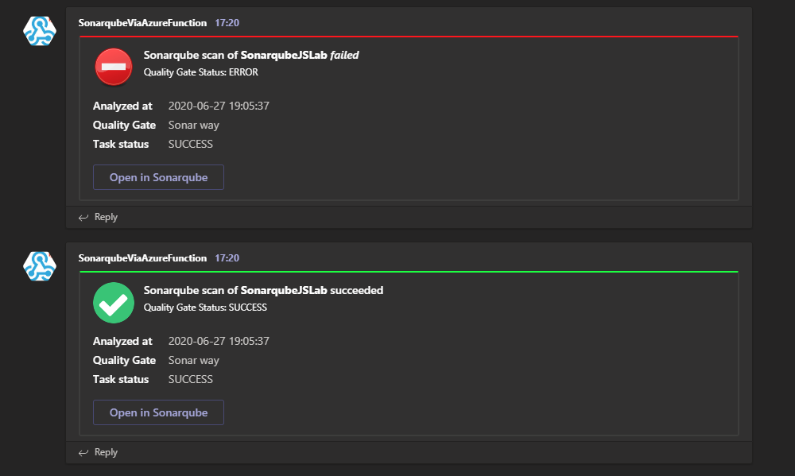
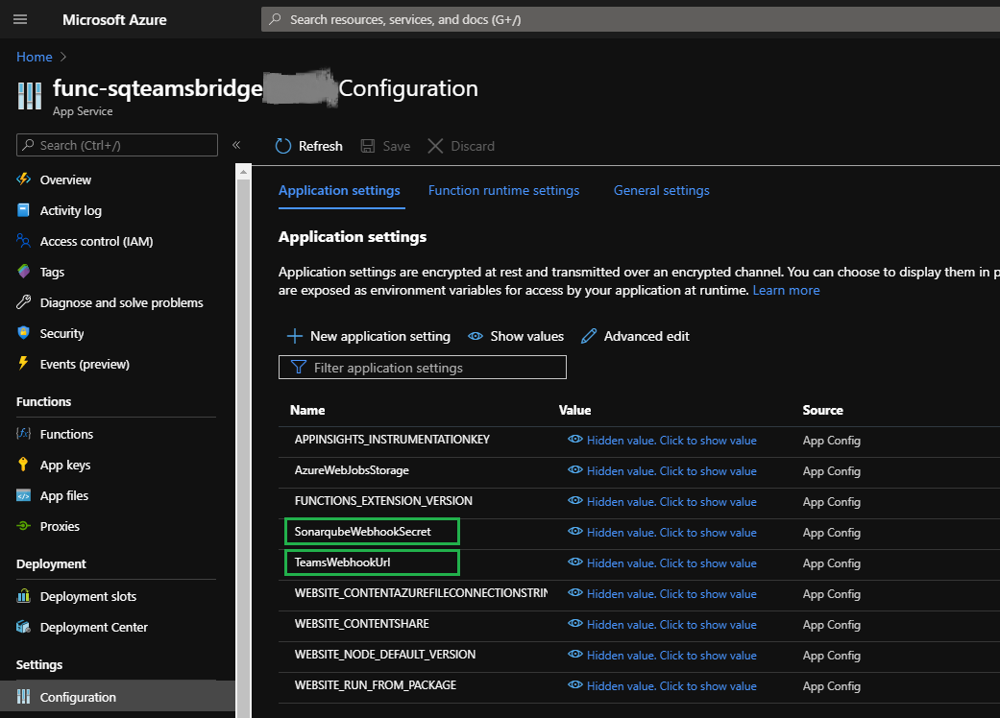
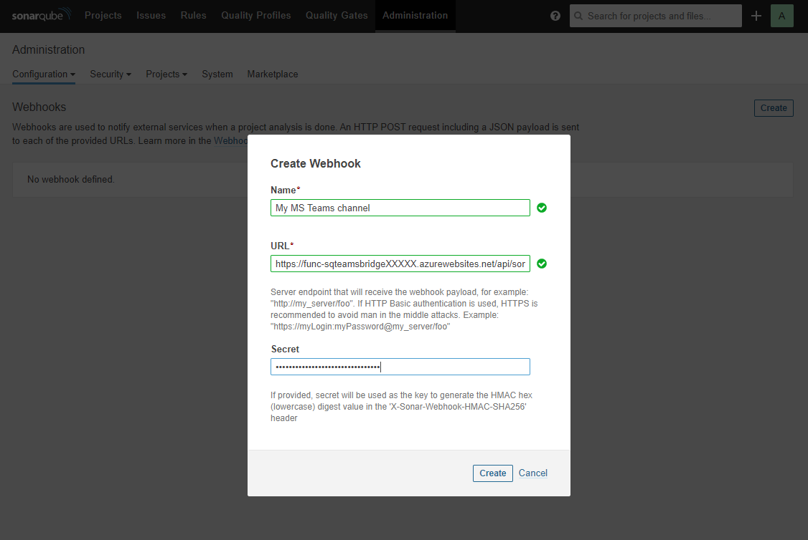

# SonarQube MS Teams Bridge

 [](https://github.com/highbyte/SonarqubeMSTeamsBridge/actions/workflows/codeql-analysis.yml)

## What
Allows [SonarQube](https://www.sonarqube.org/) scan results to be shown in a [MS Teams](https://teams.microsoft.com/start) channel.



## How
An [Azure Function](https://docs.microsoft.com/en-us/azure/azure-functions/) written in .NET Core v3.1 (C#) that processes incoming [SonarQube Webhook](https://docs.sonarqube.org/latest/project-administration/webhooks/) requests, and transforms them to a MS Teams "card" that's sent to a MS Teams channel via a [MS Teams Webhook](https://docs.microsoft.com/en-us/microsoftteams/platform/webhooks-and-connectors/how-to/add-incoming-webhook).

Tested with (it way work for other versions)
* SonarQube (Community) v8.3.1.34397
* MS Teams (Free) v1.3.00.13565

## Why
There was no SonarQube plugin for integration with MS Teams when I checked. As I'm not sufficiently proficient in Java to implement a proper Sonarqube plugin, so I did the simplest thing possible for myself to provide the functionallity.

## Deployment to Azure
You deploy this Azure Function to your own Azure Subscription.

### Deployment via script
There is a provided Powershell script (Windows) ([src/SonarqubeMSTeamsBridge/CreateAzureResourcesAndPublishFunction.ps1](src/SonarqubeMSTeamsBridge/CreateAzureResourcesAndPublishFunction.ps1)) or Bash script (Linux) ([src/SonarqubeMSTeamsBridge/CreateAzureResourcesAndPublishFunction.sh](src/SonarqubeMSTeamsBridge/CreateAzureResourcesAndPublishFunction.sh)) that creates necessary Azure resources, and compiles/uploads the Azure function project in this repository.

The scripts requires the following command line tools to be installed on the machine you run it from, on either Windows or Linux.
* [Azure CLI (az)](https://docs.microsoft.com/en-us/cli/azure/?view=azure-cli-latest)
* [Azure Functions Core Tools (func)](https://docs.microsoft.com/en-us/azure/azure-functions/functions-run-local)

#### Login to Azure via the CLI tool
```
az login
```

#### Set current Subscription (if you have more than one)
```
az account set --subscription [your_subscription_id_or_name_here] 
```

#### Script parameters
When running the script, you need to provide the following parameters
* **region**: _Code for region where resources will be created. Example: "westus", "eastus", "northeurope", "westeurope"._
* **resourceGroup**: _Name of Resource Group that will be created._
* **storageName**: _Name of Storage Account that will be created. Note: name must be unique in all of Azure._
* **functionAppName**: _Name of Function App that will be created. Note: name must be unique in all of Azure._


#### Run the script
_Note: Example parmeters below, you may want to change them._

_Powershell on Windows_
``` powershell
cd .\src\SonarqubeMSTeamsBridge
.\CreateAzureResourcesAndPublishFunction.ps1 -region "westus" -resourceGroup "rg-sqteamsbridge" -storageName "stsqteamsbridge$(Get-Random -Max 32767)" -functionAppName "func-sqteamsbridge$(Get-Random -Max 32767)"
```
_Bash on Linux_
``` bash
cd ./src/SonarqubeMSTeamsBridge
./CreateAzureResourcesAndPublishFunction.sh "westus" "rg-sqteamsbridge" "stsqteamsbridge$RANDOM" "func-sqteamsbridge$RANDOM"
```

When the script has completed, it will output the **Invoke url** of the Azure Function. 
**This is the address that should be configured in Sonarqube as a Webhook URL as described [here](#configure-sonarqube).**
```
Functions in func-sqteamsbridgeXXXXX:
    SonarqubeMSTeamsBridge - [httpTrigger]
        Invoke url: https://func-sqteamsbridgeXXXXX.azurewebsites.net/api/sonarqubemsteamsbridge
```

It will also display the Azure resources created by the script
```
Name                     ResourceGroup     Location     Type                               Status
-----------------------  ----------------  -----------  ---------------------------------  --------
func-sqteamsbridgeXXXXX  rg-sqteamsbridge  westeurope   microsoft.insights/components
stsqteamsbridgeYYYYY     rg-sqteamsbridge  westeurope   Microsoft.Storage/storageAccounts
WestEuropePlan           rg-sqteamsbridge  westeurope   Microsoft.Web/serverFarms
func-sqteamsbridgeXXXXX  rg-sqteamsbridge  westeurope   Microsoft.Web/sites
```

#### Function settings
Azure Function settings can be set via script. Change Azure resource names and values. Read [here](#azure-function-settings) about each setting.

Required settings
```
az functionapp config appsettings set --name "func-sqteamsbridgeXXXXX" --resource-group "rg-sqteamsbridge" --settings "TeamsWebhookUrl=https://outlook.office.com/webhook/XXXX"
az functionapp config appsettings set --name "func-sqteamsbridgeXXXXX" --resource-group "rg-sqteamsbridge" --settings "SonarqubeWebhookSecret=MY_SECRET"
```

Optional settings
```
az functionapp config appsettings set --name "func-sqteamsbridgeXXXXX" --resource-group "rg-sqteamsbridge" --settings "QualityGateStatusExcludeList=SUCCESS"
az functionapp config appsettings set --name "func-sqteamsbridgeXXXXX" --resource-group "rg-sqteamsbridge" --settings "Culture=en-US"
```

#### Publish Azure Function trigger only
If you already have a Azure Function resource you want to use instead of creating a new one, or if you update to a newer version of this project, you can use a separate script for this purpose. See ([src/SonarqubeMSTeamsBridge/PublishFunctionOnly.ps1](src/SonarqubeMSTeamsBridge/PublishFunctionOnly.ps1)) or ([src/SonarqubeMSTeamsBridge/PublishFunctionOnly.sh](src/SonarqubeMSTeamsBridge/PublishFunctionOnly.sh))

Script parameters
* **functionAppName**: _The name of an existing Azure Function app where the Azure Function trigger in this project will be published to._

_Note: Example parmeter below, change it to an existing Azure Function app name in your Subscription._

_Powershell on Windows_
``` powershell
cd .\src\SonarqubeMSTeamsBridge
.\PublishFunctionOnly.ps1 -functionAppName "func-sqteamsbridgeXXXX"
```

_Bash on Linux_
``` bash
cd ./src/SonarqubeMSTeamsBridge
./PublishFunctionOnly.sh "func-sqteamsbridgeXXXX"
```


### Manual Azure deployment

As an alternative to deployment via script (as described above), Visual Studio Code can be used to deploy this code to Azure Functions.

* Install "Azure Functions Core Tools": https://github.com/Azure/azure-functions-core-tools#installing
* Install Visual Studio Code extension "Azure Functions": https://marketplace.visualstudio.com/items?itemName=ms-azuretools.vscode-azurefunctions
* Clone this repo locally and open in Visual Studio Code
* Use the UI button "Deploy to Function App" from the extension "Azure Functions" (see extension doc above)
  * Select Function App in Azure: **Create new Function App in Azure... Advanced** _(or use an existing Function App if you like)_
  * Enter a globally unique name for the function app. _(will used in host name [function app name].azurewebsites.net)_
  * Select Runtime: **.NET Core 3.1**
  * Select an OS: **Windows** _(Linux also works)_
  * Select a hosting plan: _Refer to Microsoft [documentation](https://azure.microsoft.com/en-us/pricing/details/functions/) about this. The simplest is Consumption_
  * Select a resource group for new resources: _Create a new resource group, or use an exisiting, it's up to you._
  * Select a storage account: _Create a new storage account, or use an exisiting, it's up to you._
  * Select an Application Insights resource for your app: _Create a new Application Insights resource, or use an exisiting, o Skip if you don't logging. It's up to you._


#### Manual Function settings
After the necessary Azure Resources for the Function has been created from Visual Studio Code above, you can manage the Function settings in the Azure Portal. 

Open the newly created Azure Function resource (type App Service):
* Select Configuration
* Add each required setting via + New application setting



Read [here](#azure-function-settings) about each setting.

#### Azure Function Invocation URL
To get the URL to the new Azure Function, open the newly created Azure Function resource (type App Service):
* Select Functions
* Select SonarqubeMSTeamsBridge
* Press "Get Function Url" button.

**This is the address that should be configured in Sonarqube as a Webhook URL as described [here](#configure-sonarqube).**

## Azure Function settings
The Azure Function uses the following settings from environment variables.

| Setting | Required| Default value | Description |
| --- | --- | --- | --- |
| TeamsWebhookUrl |  Yes | _n/a_ | The Webhook URL that is configured in MS Teams for your channel where messages will be sent to. Read [here](https://docs.microsoft.com/en-us/microsoftteams/platform/webhooks-and-connectors/how-to/add-incoming-webhook) for details on how to set it up. |
| SonarqubeWebhookSecret | Yes | _n/a_ | The Sonarqube Webhook secret. It's used to authenticate requests from Sonarqube. It should be the same secret configured in [Sonarqube](#configure-sonarqube) |
| QualityGateStatusExcludeList | No | _Not set, empty string_ | A comma-separated list of Sonarqube Quality Gate status values that should not be sent to MS Teams. By default this is not set, and means you will get MS Teams messages for both succeed and failed scans. If you only want failed scans, then you should set this value to SUCCESS |
| Culture | No | _Not set, empty string_ | A .NET culture code that is used format Date/Time values in MS Teams card. If not specified, default .NET formating is used. Examples of codes: en-US, de-DE, sv-SE, es-ES |
| DisableAuthentication | No | _Not set, false_ | Set to true to disable Sonarqube Webhook authentication. Secret will not be validated. _Warning! Should only be used in development_


## Configure Sonarqube
* Login as administrator in Sonarqube portal
* Goto Administration -> Configuration -> Webhooks
* Create Webhook
  * Name: _Any name works_
  * URL: _The Azure Function invoke URL created above_
  * Secret: _A strong secret password_



## Running locally in VS Code
TODO

# Credits
Images
* <a href="https://commons.wikimedia.org/wiki/File:Flat_tick_icon.svg" title="via Wikimedia Commons">Fabián Alexis, cropped by Prenn</a> / <a href="https://creativecommons.org/licenses/by-sa/3.0">CC BY-SA</a>
* <a href="https://commons.wikimedia.org/wiki/File:Dialog-error.svg" title="via Wikimedia Commons">Rodney Dawes, Jakub Steiner, Garrett LeSage</a> / Public domain
* <a href="https://commons.wikimedia.org/wiki/File:Emblem-question-yellow.svg" title="via Wikimedia Commons">penubag and the people from the Tango project</a> / Public domain
